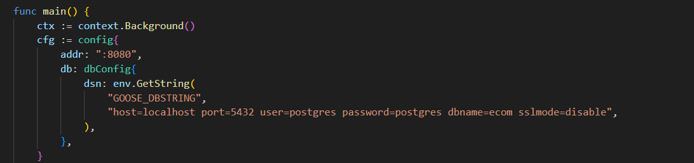

# EcommerceProject - API en Go
<!-- preciona Ctrol + Shift + V me lo agradeceras  -->
<!-- preciona Ctrol + Shift + V me lo agradeceras  -->
<!-- preciona Ctrol + Shift + V me lo agradeceras  -->
## Prerequisitos
- Docker o [PosgreSQL](https://www.postgresql.org/)

- [Goose](https://github.com/pressly/goose)
- [SQLC](https://docs.sqlc.dev/en/latest/)

## Carpeteo de proyectoo
```bash
EcomerceProject/
│
├── cmd/
│
├── internal/
│   ├── adapters/
│   │   └── postgresql/
│   │       ├── migrations/
│   │       │   ├── 00001_add_some_column.sql
│   │       │   ├── 00002_create_orders.sql
│   │       │   └── Readmemigrations.md
│   │       │
│   │       └── sqlc/
│   │           ├── db.go
│   │           ├── models.go
│   │           ├── querier.go
│   │           ├── queries.sql
│   │           └── queries.sql.go
│   ├── env/
│   │   └── env.go
│   ├── json/
│   │   └── json.go
│   ├── orders/
│   │   ├── handlers.go
│   │   ├── service.go
│   │   └── types.go
│   └── products/
│       ├── handlers.go
│       └── service.go
├── .env
├── .gitignore
├── docker-compose.yaml
├── go.mod
├── go.sum
├── Readme.md
├── Readme2.md
└── sqlc.yaml
```

## Comandos para correr el proyecto
<!-- paso 1 -->
Ejecutar en orden:
## Paso 1: Inicializar el módulo de Go
Inicializa el proyecto en Go y crea el archivo go.mod para manejar dependencias.
```bash
go mod init EcomerceProject
```
<!-- paso 2-->

## Paso 2: Instalar el router Chi
Instala la librería Chi, que se utiliza para manejar las rutas HTTP de la API.
```bash
go get -u github.com/go-chi/chi/v5
```
<!-- paso 3 -->

## Paso 3: Instalar sqlc
Instala sqlc, una herramienta que genera código Go automáticamente a partir de consultas SQL.
```bash
go install github.com/sqlc-dev/sqlc/cmd/sqlc@latest
```
<!-- paso 4 -->

## Paso 4: Instalar goose
Instala goose, que se utiliza para crear y ejecutar migraciones de la base de datos.
```bash
go install github.com/pressly/goose/v3/cmd/goose@latest
```
<!-- paso 5 -->

## Paso 5: Instalar driver de PostgreSQL
Instala el driver pgx, que permite conectar Go con PostgreSQL.
```bash
go get github.com/jackc/pgx/v5
```
<!-- paso 6 -->

## Paso 6: Ordenar dependencias
Descarga, limpia y organiza todas las dependencias necesarias del proyecto.
```bash
go mod tidy
```
<!-- paso 7 (probablemente opcional) -->

## Paso 7: Configuara PosgresSQL (Probablemente opcional)
#### Antes de usar los siguientes comandos se deve configuara PosgresSQL en dos archivos uno es .env la cual se encuentra en 
```bash
EcomerceProject/
├── cmd/
├── internal/
├── .env
```
#### Presisamente esta linea de codido
<!-- image -->


#### Y la otra es main.go la cual la en contramos sobre el directorio ./cmd 
```bash
EcomerceProject/
├── cmd/
```
 
<!-- imagen -->
#### Presisamente esta linea de codido


#### Estos parametros los modificaras dependiendo de la configuacion de tu base de datos en este caso muy proobalemente la base de datos este alojada en "neon"
```bash
host=localhost 
port=5432 
user=postgres 
password=postgres 
dbname=ecom 
sslmode=disable
```
<!-- paso 8 -->

## Paso 8: Generar código con sqlc
Genera automáticamente los archivos Go a partir de las consultas SQL definidas en la carpeta.
```bash
EcomerceProject/
└── internal/
    └── adapters/
        └── postgresql/
            └── sqlc/
```
Este paso crea los modelos y funciones para interactuar con la base de datos.
```bash
sqlc generate
```
<!-- paso 9-->

## Paso 9: Ejecutar migraciones de la base de datos
Aplica las migraciones pendientes en PostgreSQL y crea las tablas necesarias en la base de datos.
```bash
goose up
```
<!-- paso 10-->

## Paso 10: Ejecutar la API
```bash
go run ./cmd
```
 
# Nota
El siguiente comando solo se utilizara si se desea agregar una nueva migracion
```bash
goose -s create add_some_column sql
```